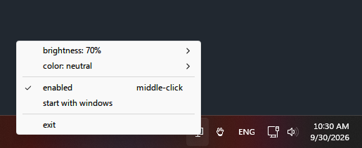

# dimmest: a free screen dimmer for Windows 11 and 10

dim → dimmer → **dimmest**.

**Make your screen darker than the lowest brightness setting.** dimmest is a tiny, free and
open-source screen dimmer for Windows 11 and Windows 10. It lives in the system tray and dims
your whole screen, including the taskbar, the Start menu and popup menus. It can also warm up the
colors like a night light or blue light filter, or tint the screen amber, red or grayscale.

- Works on laptops and external monitors, even ones Windows can't change the brightness of
- Nothing to install and no admin rights needed: it's a single ~190 KB exe
- Uses about 13 MB of RAM and next to no CPU
- A spiritual successor to [dimmer](https://github.com/clangen/dimmer) by Casey Langen

Looking for an open-source alternative to PangoBright, CareUEyes, Iris or f.lux? dimmest covers
the dimming and warm-color part, with nothing else attached.

> **Status:** v0.1.0, first working build. No release download yet; build it yourself (see below).

## How to use



- **Left- or right-click** the tray icon: brightness (100% to 10% in 5% steps), color, on/off, start with Windows, exit
- **Middle-click** the tray icon: turn dimming on/off
- Settings are saved in `%APPDATA%\dimmest\dimmest.ini`

Colors: neutral, 5500K / 4500K / 3400K / 2700K / 1900K, amber, red (night vision),
sepia, grayscale, or any custom color.

## Features

- [x] Dims everything: apps, popups, menus, taskbar, Start, notifications
- [x] Color temperature from 5500K down to 1900K
- [x] Color tints: amber, red night mode, sepia, grayscale, custom color
- [x] Start with Windows
- [x] Tray icon follows the light/dark taskbar theme
- [x] Re-applies after sleep, display power-on, unlock and explorer restarts (needs real-world testing)
- [ ] Per-monitor mode (different level per monitor)
- [ ] Global hotkeys

## FAQ

### How do I make my screen darker than the minimum brightness on Windows?

Run dimmest, click its tray icon and pick a brightness. It dims in software, on top of your
monitor's own backlight, so you can keep going after the Windows brightness slider hits 0%.

### How do I dim an external monitor on Windows?

The Windows brightness slider often does nothing on external monitors. dimmest dims the picture
Windows sends to the screen, so it works on any monitor, whether it's connected by HDMI,
DisplayPort or USB-C.

### Does it dim the taskbar, the Start menu and right-click menus?

Yes. Most dimmers put a see-through window on top of the screen, and Windows draws menus, the
taskbar and Start above it. dimmest uses the Windows Magnification API's color effect instead,
which applies to everything on screen. The only thing it doesn't dim is the mouse pointer.

### Is it a blue light filter or a Night light alternative?

Partly. The warm color temperatures (down to 1900K) and the amber and red tints cut blue light,
like Windows Night light or f.lux, and you can combine them with dimming.

### Is it free? Is it safe?

It's free and open source under the BSD license, so you can read every line of the code.
It doesn't need administrator rights, doesn't install anything and doesn't connect to the internet.

### Does it dim each monitor separately?

Not yet. Right now every monitor gets the same brightness and color. A per-monitor mode is planned.

## Why a successor?

dimmer was great, but it's from 2017. It dims the screen by putting a
semi-transparent window on top of everything, and that approach has limits:

- the overlay sometimes disappears (monitor sleep, waking the PC, other "always on top" windows)
- popup menus, the taskbar and the Start menu are not dimmed unless you turn on a hack that polls 100 times a second
- color temperature uses gamma ramps, which Windows resets after sleep, UAC prompts and games

dimmest dims with the Magnification API's full-screen color effect instead, so there's no
overlay window to lose.

## Building

Requires Visual Studio 2022 (MSVC) and CMake 3.21+. x64 only; the Magnification API doesn't work in 32-bit processes on 64-bit Windows.

```
cmake -S . -B build -G "Visual Studio 17 2022" -A x64
cmake --build build --config Release
```

The exe lands in `build\Release\dimmest.exe`. It has no dependencies.

## License

standard 3-clause bsd, same as the original. do whatever you want with it, just don't blame me if it
breaks something. it's called dimmest for a reason.

See [LICENSE](LICENSE).
